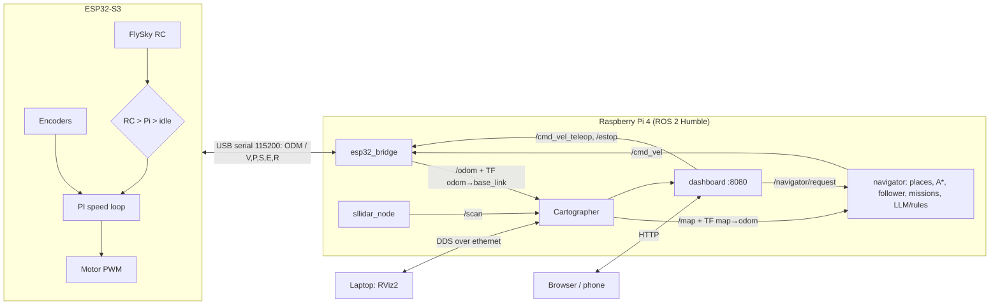

# SLAM Robot — ROS 2 differential-drive robot with LiDAR SLAM

An indoor mobile robot that maps a building with **Cartographer SLAM**, remembers **named places**,
plans **routes around walls (A\*)**, takes **plain-English commands** (Groq LLM with an offline
fallback), runs a **priority mission queue**, and can be driven from an RC transmitter, a web app
or RViz. Wheel-encoder odometry comes from an ESP32.

| | |
|---|---|
| Compute | Raspberry Pi 4, Ubuntu 22.04, ROS 2 Humble (headless) |
| LiDAR | Slamtec RPLiDAR A1M8, 360°, 10 Hz, 12 m |
| Low-level | ESP32-S3 or classic ESP32 (auto pin map): motor PWM, quadrature encoders, PI wheel-speed loop, RC input |
| Drive | 2 × DC gear motors with encoders (4740 ticks/rev), BTS7960-style H-bridges, 125 mm wheels, 300 mm track |
| Manual | FlySky FS-i6 + FS-iA6 receiver (always overrides software) |
| SLAM | Cartographer 2D (LiDAR + odometry, or LiDAR-only fallback) |


<sub>Web app (here on `tools/dashboard_sim.py`): planned route, place pins, natural-language command, mission queue, LiDAR, e-stop.</sub>

## Architecture



**TF tree:** `map → odom → base_link → laser`
**Command priority:** E-stop (latched in the ESP32) › RC sticks › dashboard teleop › navigator › stop.
Every layer has a watchdog: browser → 0.5 s, bridge → 0.5 s, ESP32 → 0.3 s, RC signal loss → 0.1 s,
stale SLAM pose → goal controller stops in 0.6 s.

## Repository layout

```
firmware/robot_esp32/        ESP32-S3 / classic ESP32 Arduino sketch (core 2.x and 3.x)
ros2_ws/src/lidar_robot/     ROS 2 package (ament_python)
  lidar_robot/               esp32_bridge, navigator, dashboard, goal_controller (+ pure-Python logic:
                             planner, follower, places, commands, missions, navigator_core)
  lidar_robot/web/           dashboard page (single file, works offline)
  config/                    robot_params.yaml, cartographer_{odom,lidar_only,localization}.lua
  launch/bringup.launch.py   one launch file for everything
  test/                      unit tests, controller simulation, bridge-over-pty integration test
tools/                       serial_probe.py (debug/calibrate ESP32), dashboard_sim.py (UI without robot)
rviz/robot.rviz              RViz2 layout for the laptop
udev/ scripts/               stable /dev names, laptop ethernet setup, systemd autostart
hardware/                    pin map, wiring, BOM, CAD, photos
docs/                        deploy, calibration, navigation (app + API), troubleshooting, roadmap
maps/                        saved maps (.pgm + .yaml)
```

## Quick start

On the Pi (full guide: [docs/deploy.md](docs/deploy.md)):

```bash
cd ~/ros2_ws && colcon build --symlink-install --packages-select lidar_robot
source install/setup.bash
ros2 launch lidar_robot bringup.launch.py                      # map the floor (then Save map)
ros2 launch lidar_robot bringup.launch.py slam_mode:=localization map:=~/maps/cse_floor.pbstream
ros2 launch lidar_robot bringup.launch.py use_odometry:=false  # LiDAR-only fallback
```

On the laptop:

```bash
rviz2 -d rviz/robot.rviz          # use the "2D Goal Pose" tool to send the robot somewhere
xdg-open http://169.254.1.2:8080  # web dashboard: joystick, e-stop, map, click-to-goal, save map
```

No robot? `python3 tools/dashboard_sim.py` runs the dashboard against a simulated robot.

## Status

- [x] LiDAR → Cartographer → live map in RViz over ethernet
- [x] ESP32 firmware v2.1: velocity commands, PI wheel loop, RC override + failsafe, e-stop latch
- [x] Bridge with reconnect, teleop/nav arbitration, e-stop
- [x] Web dashboard: joystick, e-stop, live map, save map
- [x] Navigator: named places + search, A* routes with preview, path following, replanning around
      obstacles, priority mission queue, NL commands (LLM + offline fallback), failure reason codes
      ([docs/navigation.md](docs/navigation.md)), tested in simulation
- [x] Localization on a saved map (Cartographer pure localization + operator confirmation)
- [ ] Encoder odometry verified on hardware (calibration: [docs/calibration.md](docs/calibration.md))
- [ ] Navigator verified on the real robot and floor
- [ ] LLM error recovery + campus app — see [docs/roadmap.md](docs/roadmap.md)

## Tests

```bash
cd ros2_ws/src/lidar_robot && python3 -m pytest test/     # no ROS needed
```

## License

MIT — see [LICENSE](LICENSE).
